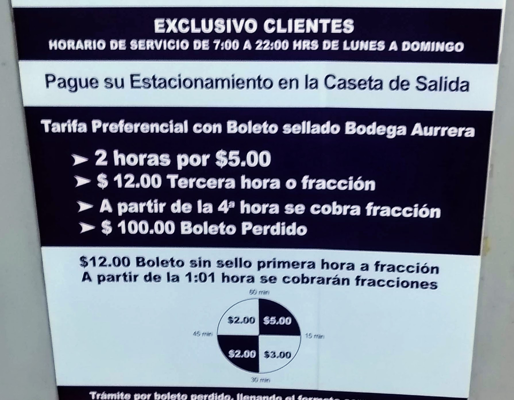

# Tarifa de estacionamiento
Decisiones - Determina la tarifa a pagar en un estacionamiento público.

Modifica el programa que se encuentra en la carpeta `src` que se llama
`exercise.py` y que contiene el siguiente código:

```python
def parking_cost(hours, minutes):
    # Write your code here


def main():
    hours = int(input("Enter number of hours: "))
    minutes = int(input("Enter number of minutes: "))
    print(parking_cost(hours, minutes))


if __name__ == '__main__':
    main()
```

Un estacionamiento público cobra una tarifa que varía según el tiempo que un
auto haya permanecido dentro. La tarifa se determina según la siguiente imagen:


El programa va a preguntar por dos números, la cantidad de horas, y la cantidad
de minutos que duró un carro en el estacionamiento.
Calcula el precio que debe pagar un auto que haya permanecido ese tiempo.

La salida del programa debe de ser exactamente de la siguiente forma:

```plaintext
Enter number of hours: 1
Enter number of minutes: 40
Total to pay: 5
```

```plaintext
Enter number of hours: 3
Enter number of minutes: 1
Total to pay: 22
```

```plaintext
Enter number of hours: 6
Enter number of minutes: 50
Total to pay: 65
```

Únicamente necesitas modificar la función **parking_cost**.
Elimina la palabra __pass__ y escribe el código necesario.
Asegurarte de que la función regrese el valor correcto.

Una vez que termines tu actividad y la hayas probado con `pytest --tb=short`,
subela a tu repositorio en GitHub, con el proceso de commit + push.
