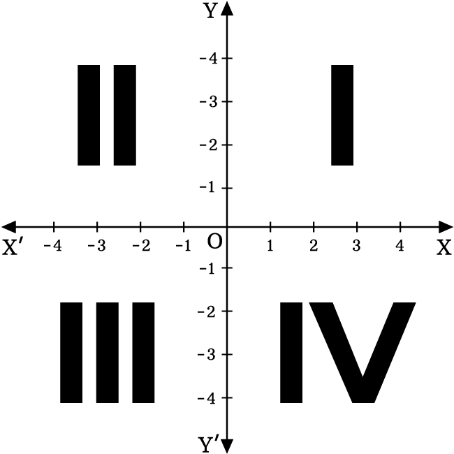

# Cuadrante en el plano cartesiano
Decisiones - Determina en qué cuadrante del plano cartesiano se encuentra
un punto dado.

Modifica el programa que se encuentra en la carpeta `src` que se llama
`exercise.py` y que contiene el siguiente código:

```python
def quadrant(x, y):
    # Write your code here
    pass


def main():
    x = float(input("Enter X coordinate of the point: "))
    y = float(input("Enter Y coordinate of the point: "))
    print(f"The point is in quadrant: {quadrant(x, y)}")


if __name__ == '__main__':
    main()
```

El plano cartesiano se divide en 4 cuadrantes, que van en sentido contrario
a las manecillas del reloj. El cuadrante depende del signo de las coordenadas
del punto en X y Y.



El programa va a preguntar por dos números, las coordenadas en X y en Y,
y luego imprimirá en qué cuadrante se encuentra el punto dado.
Las respuestas pueden incluir, además de los cuatro cuadrantes
(I, II, III y IV), el **Origin** o los puntos sobre los ejes: **X axis** o
**Y axis**.

La salida del programa debe de ser exactamente de la siguiente forma:

```plaintext
Enter X coordinate of the point: 0
Enter Y coordinate of the point: 0
The point is in quadrant: Origin
```

```plaintext
Enter X coordinate of the point: 2
Enter Y coordinate of the point: 2
The point is in quadrant: I
```

```plaintext
Enter X coordinate of the point: -4.7
Enter Y coordinate of the point: 0
The point is in quadrant: Y axis
```

Únicamente necesitas modificar la función **quadrant**.
Elimina la palabra __pass__ y escribe el código necesario.
Asegurarte de que la función regrese el valor correcto.

Una vez que termines tu actividad y la hayas probado con `pytest --tb=short`,
subela a tu repositorio en GitHub, con el proceso de commit + push.
